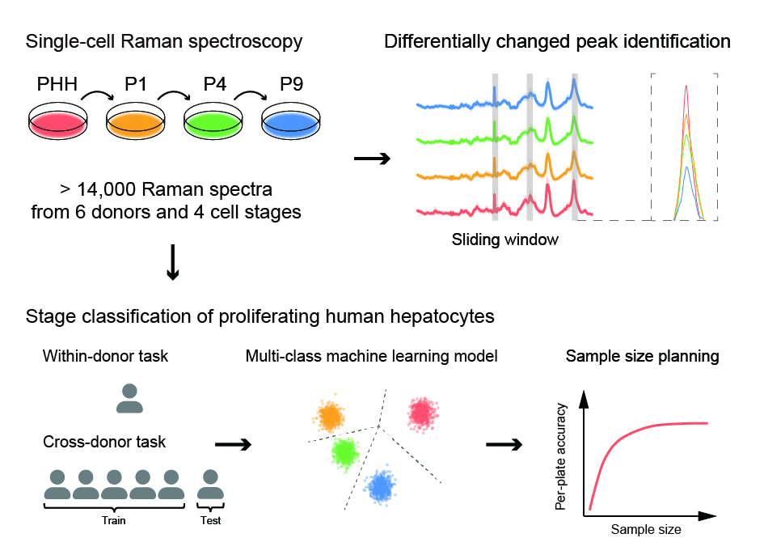

# Applying machine learning for multi-individual Raman spectroscopic data to identify different stages of proliferating human hepatocytes

## Repository structure
* `assets` - ressources for repository
* `scripts` - analysis scripts
    * `1.preprocess` data preprocessing
    * `2.modeling` machine learning models

## Citation
Please cite our paper if you find this work is helpful to your research.

> Bihan Shen\#, Chen Ma\#, Lili Tang, Zhitao Wu, Zhaoliang Peng, Guoyu Pan\* and Hong Li\*. (2024) Applying machine learning for multi-individual Raman spectroscopic data to identify different stages of proliferating human hepatocytes.

